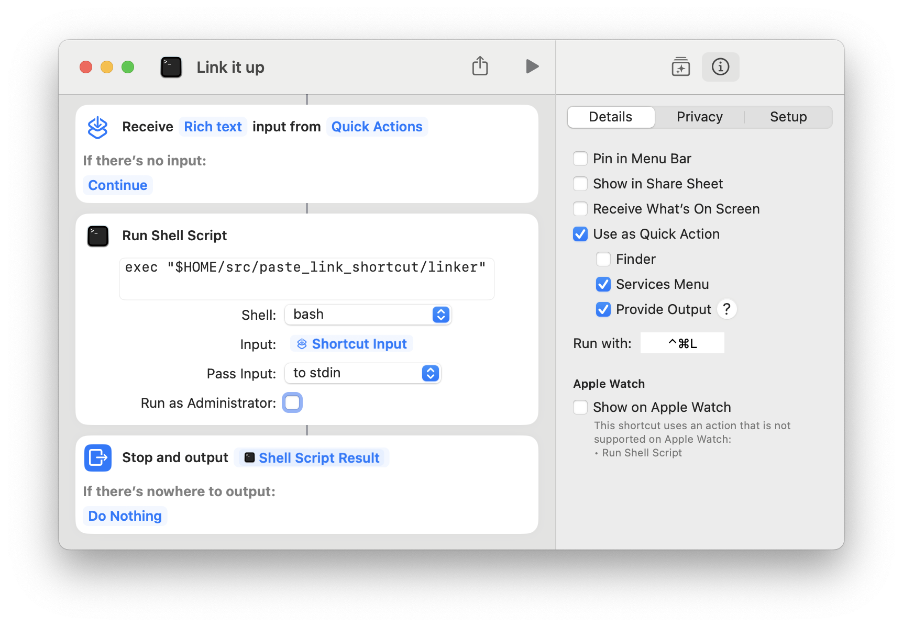

# Paste Link Shortcut

macOS shortcut to link the selected text to the URL on the clipboard.

I wrote this because the UI to add a link in Apple Notes on macOS Sonoma is disastrously bad (can't easily link text using just the keyboard, plus there's a bug where the Add Link dialog just doesn't do anything after you click OK 🤦).

## Installation

Clone this repo, then compile the script:

```
swiftc linker.swift
```

Then create a shortcut in Shortcuts like so:



Make sure the path matches the location where you cloned the repo. Choose whatever keyboard shortcut works for you.

## Caveats

- I've only tested this using Apple Notes and TextEdit so I have no idea if it works in other applications.
- Output may be a little weird depending on the formatting of the selected text. I've only really tested it with selections inside a paragraph or list item.
- The script will silently do nothing if:
  - It doesn't think the clipboard contains a link
  - The selection doesn't seem to support output of links (e.g. selection is plain text rather than rich text)
- If the selected text already contains links, they will be overwritten.
- Font size is not preserved, at least in Apple Notes. Heading vs. body text should be preserved though.
